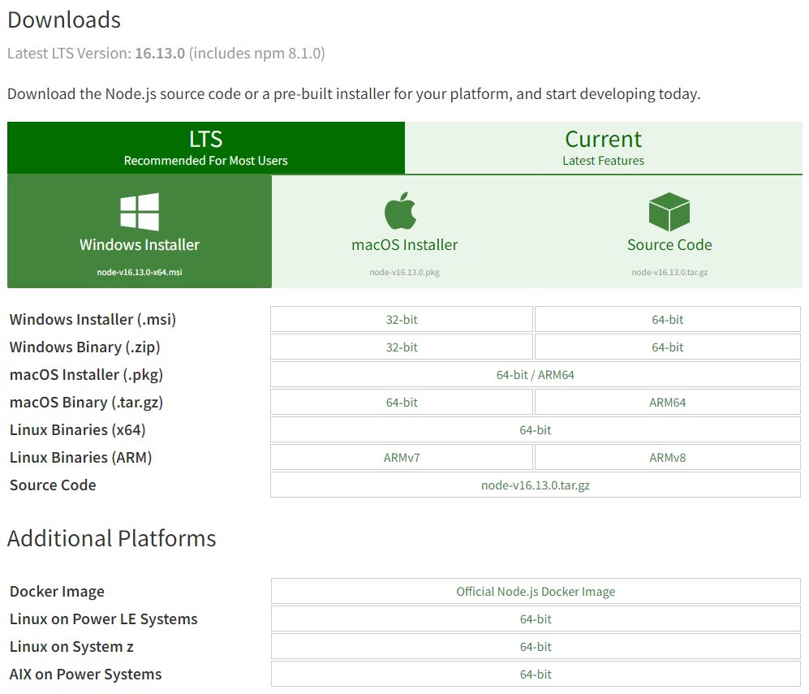

# 💽 Installation

#### 1. ทำการติดตั้ง node js runtime

&#x20;โดยเข้าไปที่  [https://nodejs.org/en/download/](https://nodejs.org/en/download/)



#### 2. ทำการติดตั้ง vue cli

&#x20;โดยใช้คำสั่ง ผ่านทาง command prompt

```
npm install -g @vue/cli
```


#### 3. ติดตั้ง vs code ide&#x20;

โดยเข้าไปที่ [https://code.visualstudio.com/download](https://code.visualstudio.com/download) เมื่อ download เสร็จแล้วจากนั้นทำการ ติดตั้งให้เรียบร้อย


&#x20;

#### 4. ทำการสร้าง Folder Project

โดยทำการตั้ง ชื่อว่า `bsru_kanban_board`

```
cd c:/
mkdir bsru_kanban_board
cd bsru_kanban_board
```

#### 5. ทำการติดตั้ง vue js เข้ามาใน project&#x20;

โดยใช้ เครื่องมือ vue cli

```
vue create .
```

.png>)

.png>)

.png>)

.png>)

.png>)

#### 6. ทำการ run ทดสอบ

โดยทำการ พิมพ์คำสั่ง

```
npm run serve
```

.png>)

.png>)

จากนั้นทำการเปิด web browser โดยเข้าไปที่ URL : [http://localhost:8080/](http://localhost:8080)

.png>)

Github : [https://github.com/ujiik009/bsru-kanban-board/tree/a0e67dede20be42ea367905fe1286432264902cd](https://github.com/ujiik009/bsru-kanban-board/tree/a0e67dede20be42ea367905fe1286432264902cd)
