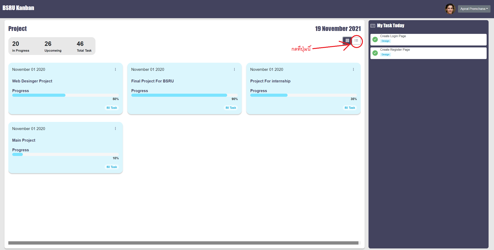

# 📀 4.2 Create Component view list

.png>)

#### 1. ทำการ สร้าง component ที่ชื่อว่า `CircularProgress` ใช้สำหรับ แสดงผล วงแหวน Progress

.png>)

โดยการสร้างไฟล์ชื่อ `CircularProgress.vue` ภายใต้ `src/components/ProjectList/components`

.png>)

จากนั้นทำการเปิดไฟล์ `CircularProgress.vue` ภายใต้ `src/components/ProjectList/components`

จากนั้นทำการ copy code ด้านล้างไปแทนที่


```javascript
<template>
  <div
    id="progress"
    role="progressbar"
    :aria-valuenow="percent"
    aria-valuemin="0"
    aria-valuemax="100"
    :style="{ ['--value']: percent,['--size']:`${size}px` }"
  ></div>
</template>

<script>
export default {
  props: {
    percent: Number,
    size:Number
  },
};
</script>

<style >
@keyframes growProgressBar {
  0%,
  33% {
    --pgPercentage: 0;
  }
  100% {
    --pgPercentage: var(--value);
  }
}

@property --pgPercentage {
  syntax: "<number>";
  inherits: false;
  initial-value: 0;
}

#progress {
  --size: var(--size);
  --fg: #23C3E7;
  --bg: #23c3e755;
  --pgPercentage: var(--value);
  animation: growProgressBar 3s 1 forwards;
  width: var(--size);
  height: var(--size);
  border-radius: 50%;
  display: grid;
  place-items: center;
  background: radial-gradient(
      closest-side,
      #DBF6FD 80%,
      transparent 0 99.9%,
      #DBF6FD 0
    ),
    conic-gradient(var(--fg) calc(var(--pgPercentage) * 1%), var(--bg) 0);
  font-family: Helvetica, Arial, sans-serif;
  font-size: calc(var(--size) / 5);
  color: var(--fg);
}

#progress::before {
  counter-reset: percentage var(--value);
  content: counter(percentage) "%";
  border-radius: 20px;
}
</style>
```


จากนั้นให้ทำการเปิด ไฟล์ชื่อว่า `ProjectViewList.vue` ภายใต้ `src/components/ProjectList/components `แล้วให้ทำการ copy code ด้านล้างไปแทนที่


```javascript
<template>
  <div>
    <div
      @click="open_project(project.id)"
      class="list-item-project"
      v-for="(project, index) in projects"
      :key="index"
    >
      <div class="container-item">
        <div class="center-vertical name-project-text">{{ project.name }}</div>
      </div>
      <div class="container-item">
        <div class="center-vertical">
          <div style="font-weight: bold">Created at</div>
          <div>{{ show_created_at(project.created_at) }}</div>
        </div>
      </div>
      <div class="container-item">
        <div class="center-vertical">
          <div style="font-weight: bold">Task Count</div>
          <div style="text-align: center">
            <b-badge class="badge-label-task-list">{{
              project.task_count
            }}</b-badge>
          </div>
        </div>
      </div>
      <div class="container-item" style="display: flex">
        <div
          class="center-vertical right"
          style="font-size: 20px; font-weight: bold"
        >
          Progress
        </div>
      </div>
      <div class="container-item">
        <div class="center-vertical">
          <CircularProgress :size="100" :percent="project.percent" />
        </div>
      </div>
    </div>
  </div>
</template>

<script>
import moment from "moment";
import CircularProgress from "@/components/ProjectList/components/CircularProgress.vue";
export default {
  components: {
    CircularProgress,
  },
  props: {
    projects: Array,
  },
  methods: {
    show_created_at(date) {
      return moment(date, "YYYY-MM-DD HH:mm:ss").format("MMM DD YYYY HH:mm:ss");
    },
    open_project(project_id) {
      this.$router.push(`/project/content/${project_id}`);
    },
  },
};
</script>

<style>
.badge-label-task-list {
  border-radius: 20px;
  font-size: 20px;
  background-color: #b6ecf8 !important;
  color: #23c3e7;
}
.name-project-text {
  font-weight: bold;
}
.container-item {
  position: relative;
  padding: 10px;
  height: 100%;
  width: 100%;
}
.center-vertical {
  margin: 0;
  position: absolute;
  top: 50%;
  -ms-transform: translateY(-50%);
  transform: translateY(-50%);
}
.right {
  position: absolute;
  right: 0%;
}
.list-item-project {
  cursor: pointer;
  color: #43435e;
  display: flex;
  justify-content: space-between;
  border-radius: 5px;
  margin-top: 20px;
  height: 150px;
  background-color: #dbf6fd;
  box-shadow: 0px 4px 4px 0px rgba(0, 0, 0, 0.2);
  -webkit-box-shadow: 0px 4px 4px 0px rgba(0, 0, 0, 0.2);
  -moz-box-shadow: 0px 4px 4px 0px rgba(0, 0, 0, 0.2);
}
</style>
```


จากนั้นให้ ใช้คำสั่ง `npm run serve` ที่ terminal&#x20;

แล้วเปิด web browser URL : [http://localhost:8080/#/project-list](http://localhost:8080/#/project-list) จะได้ผลลัพธ์ดังนี้

.png>)



.png>)

Github : [https://github.com/ujiik009/bsru-kanban-board/tree/6595bf2f63e242dfb3dd4b0cdaf759c5345671b4](https://github.com/ujiik009/bsru-kanban-board/tree/6595bf2f63e242dfb3dd4b0cdaf759c5345671b4)
