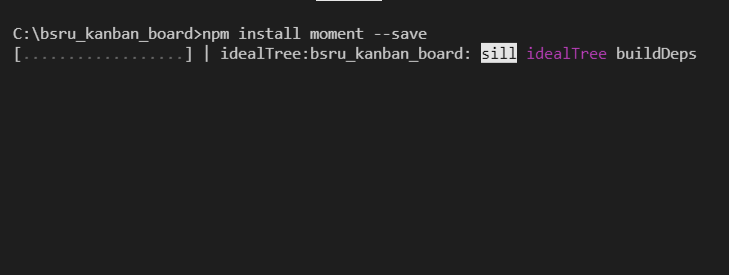

# 🌐 4. Create Projects List Page

.png>)

.png>)

#### 1. ทำการสร้าง Folder ที่ชื่อว่า `ProjectList` ภายใต้ ภายใต้ `src/components`

.png>)

จากนั้น ให้ทำการสร้าง ไฟล์ ชื่อ `index.vue` ภายใต้ `src/components/ProjectList`

 (1).png>)

ทำการ Register component กับ `vue-router` ให้ทำการเปิด ไฟล์ `main.js` ภายใต้ `src/` และทำการ copy code ชุดนี้ไปแทนที่


```javascript
import Vue from 'vue'
import App from './App.vue'

// 1. import bootstrap
import { BootstrapVue, IconsPlugin } from 'bootstrap-vue'
// 5. import vue-router
import VueRouter from 'vue-router'
// 2. Import Bootstrap an BootstrapVue CSS files (order is important)
import 'bootstrap/dist/css/bootstrap.css'
import 'bootstrap-vue/dist/bootstrap-vue.css'

// import LoginPage component
import LoginPage from "@/components/LoginPage/index.vue"
// import CreateAccountPage component
import CreateAccountPage from "@/components/CreateAccountPage/index.vue"
// import MainLayout component
import MainLayout from "@/components/MainLayout/index.vue"
// import ProjectList component
import ProjectList from "@/components/ProjectList/index.vue"
Vue.config.productionTip = false

// defind you route
const routes = [
  { path: '/', component: LoginPage },
  { path: '/create-account', component: CreateAccountPage },
  {
    path: '/main', component: MainLayout,
    children: [
      {
        path: "/project-list",
        name: "project-list",
        component: ProjectList
      }
    ]
  }
]

// router object
const router = new VueRouter({
  routes // short for `routes: routes`
})


// 3. Make BootstrapVue available throughout your project
Vue.use(BootstrapVue)
// 4.Optionally install the BootstrapVue icon components plugin
Vue.use(IconsPlugin)
// 6. Make vue-router available
Vue.use(VueRouter)

new Vue({
  // register router to vue instant
  router,
  render: h => h(App),
}).$mount('#app')
```


หน้านี้ จำเป็นต้อง ใช้ lib เกี่ยวกับการจัดการ วันเวลา จึงจำเป็นต้องติดตั้ง lib เพิ่มเติม โดย ใช้คำสั่งว่า

```shell
npm install moment --save
```



จากนั้นทำการเปิดไฟล์ `index.vue` ภายใต้ `src/components/ProjectList` แล้วทำการ copy code ชุดนี้ไปแทนที่


```javascript
<template>
  <div class="content-page">
    <div class="container-box">
      <div class="content-left">
        <div id="project-box">
          <div id="project-box-header" class="font-impact">
            <div>Project</div>
            <div>{{ date_now }}</div>
          </div>
          <div id="summary-box">
            <div>
              <div
                style="
                  display: flex;
                  justify-content: space-between;
                  width: 450px;
                  background-color: #e8e8e8;
                  padding: 10px 20px 10px 20px;
                  border-radius: 20px;
                "
              >
                <div>
                  <div style="font-size: 32px; font-weight: bold">{{in_progress}}</div>
                  <div style="font-weight: bold">In Progress</div>
                </div>
                <div>
                  <div style="font-size: 32px; font-weight: bold">{{upcomeing}}</div>
                  <div style="font-weight: bold">Upcomeing</div>
                </div>
                <div>
                  <div style="font-size: 32px; font-weight: bold">{{total_task}}</div>
                  <div style="font-weight: bold">Total Task</div>
                </div>
              </div>
            </div>
            <div>
              <b-button
                @click="view_page_active = 'list'"
                v-bind:class="{
                  ['btn-view']: true,
                  ['active-btn']: view_page_active == 'list',
                }"
                ><b-icon icon="list-ul"></b-icon
              ></b-button>
              <b-button
              @click="view_page_active = 'card'"
                v-bind:class="{
                  ['btn-view']: true,
                  ['active-btn']: view_page_active == 'card',
                }"
                ><b-icon icon="grid-3x3-gap-fill"></b-icon
              ></b-button>
            </div>
          </div>
        </div>
      </div>
      <div class="content-right">
        <div id="my-task-today">
          <div style="color: #ffffff; font-size: 24px" class="font-impact">
            <b-icon icon="card-checklist"></b-icon>
            <span style="margin-left: 10px">My Task Today</span>
          </div>
          <div class="my-task-today-zone">
            <div class="task" v-for="(task, index) in tasks" :key="index">
              <div style="width: 50px">
                <div class="round" style="margin-top: 15px; margin-left: 10px">
                  <input
                    type="checkbox"
                    :id="`${'checkbox'}${index}`"
                    :checked="task.status"
                    @change="task.status = !task.status"
                  />
                   <label :for="`${'checkbox'}${index}`"></label>
                </div>
              </div>
              <div>
                <div class="overme">{{ task.name }}</div>
                <div>
                  <b-badge class="badge-label">{{ task.label }}</b-badge>
                </div>
              </div>
            </div>
          </div>
        </div>
      </div>
    </div>
  </div>
</template>

<script>
import moment from "moment";
export default {
  data() {
    return {
      view_page_active: "list", // list,card
      date_now: moment().format("DD MMMM YYYY"),
      in_progress:20,
      upcomeing:26,
      total_task:46,
      tasks: [
        {
          name: "Create Login Page",
          label: "Design",
        },
        {
          name: "Create Register Page",
          label: "Design",
        },
      ],
    };
  },
};
</script>

<style>
.btn-view {
  background-color: white;
  color: #43435e;
}
.active-btn{
  background-color: #43435e !important;
  color: white !important;
}
.btn-view:active,
.btn-view:focus,
.btn-view:hover {
  background-color: #43435e !important;
  color: white !important;
}

#summary-box {
  margin-top: 20px;
  display: flex;
  justify-content: space-between;
}
.badge-label {
  background-color: #dbf6fd;
  color: #00acd9;
}
.overme {
  width: 300px;
  overflow: hidden;
  white-space: nowrap;
  text-overflow: ellipsis;
}
.task {
  margin-top: 10px;
  min-height: 60px;
  background-color: white;
  border-radius: 5px;
  display: flex;
}
.my-task-today-zone {
  margin-top: 15px;
  height: 90%;
  overflow-y: auto;
}
/* width */
.my-task-today-zone::-webkit-scrollbar {
  width: 5px;
}

/* Track */
.my-task-today-zone::-webkit-scrollbar-track {
  background: #f1f1f1;
}

/* Handle */
.my-task-today-zone::-webkit-scrollbar-thumb {
  background: #888;
}

/* Handle on hover */
.my-task-today-zone::-webkit-scrollbar-thumb:hover {
  background: #555;
}

.content-page {
  height: 100%;
  overflow-y: auto;
  background-color: #e7e7e7;
  padding-left: 20px;
  padding-right: 20px;
  /* background-color: lightcoral; */
}
.container-box {
  display: flex;
  height: inherit;
}
.content-left {
  padding: 10px;
  flex: 3;
  height: inherit;
}
.content-right {
  flex: 1;
  padding: 10px;
  height: inherit;
}
#project-box {
  padding: 20px;
  background-color: white;
  border-radius: 10px;
  height: 100%;
  box-shadow: 0px 4px 4px 0px rgba(0, 0, 0, 0.2);
  -webkit-box-shadow: 0px 4px 4px 0px rgba(0, 0, 0, 0.2);
  -moz-box-shadow: 0px 4px 4px 0px rgba(0, 0, 0, 0.2);
}

#my-task-today {
  border-radius: 10px;
  padding: 10px;
  background-color: #43435e;
  height: 100%;
}

#project-box-header {
  font-size: 32px;
  color: #43435e;
  display: flex;
  justify-content: space-between;
}

.round {
  position: relative;
}

.round label {
  background-color: #fff;
  border: 1px solid #ccc;
  border-radius: 50%;
  cursor: pointer;
  height: 28px;
  left: 0;
  position: absolute;
  top: 0;
  width: 28px;
}

.round label:after {
  border: 2px solid #fff;
  border-top: none;
  border-right: none;
  content: "";
  height: 6px;
  left: 7px;
  opacity: 0;
  position: absolute;
  top: 8px;
  transform: rotate(-45deg);
  width: 12px;
}

.round input[type="checkbox"] {
  visibility: hidden;
}

.round input[type="checkbox"]:checked + label {
  background-color: #66bb6a;
  border-color: #66bb6a;
}

.round input[type="checkbox"]:checked + label:after {
  opacity: 1;
}
</style>
```


จากนั้นให้ ใช้คำสั่ง `npm run serve` ที่ terminal&#x20;

แล้วเปิด web browser URL : [http://localhost:8080/#/project-list](http://localhost:8080/#/project-list) จะได้ผลลัพธ์ดังนี้

.png>)
